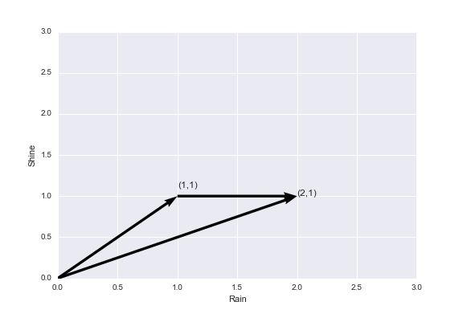

---
author:
- 'Dr. Qiaoqiao Zhu ©'
subtitle: 'Lecture 3: Contingent Claims & Stochastic Discount Factor'
title: FINM8006 Advanced Investments
...

Review
======
### Review of last lecture

#### 

Last Lecture, we

-   Introduced preference and utility

-   Introduced expected utility theory to deal with risk & uncertainty

    -   risk aversion $\Leftrightarrow$ concavity

    -   risk premium is proportional to variance of risk,
        $\pi \approx \frac{1}{2}A(w)\sigma^{2}$

    -   critiques of expected utility

Let’s build a pricing model based on those tools.

State Space Pricing
===================

Contingent Claims
----------------------------

### State space and payoff space
We typically only see payoff and price of assets in realized states of the world, that space is called payoff space. In stead, the potential states of the world is called state space. 

-   A contingent claim (Arrow-Debreu pure security) is a security that
    pays \$1 if a given state occurs and nothing if any other state
    occurs in state space $S$. $s=(1,\cdots, S)$ with probability
    $(\pi_{1},\cdots,\pi_{S})$
-   The payoff space $\underline{X}$ is the space spanned by the vectors
    of N traded security $(x_{1},x_{2},\cdots, x_{N})$. In words, it is
    the set of all payoffs that investors can purchase. Note that each
    $x_{i}$ is a vector, with one payoff in each state $s\in S$.

#### Replicate contingent claim

-   We can’t always buy pure security, but we can replicate with a
    portfolio of $x_{i}$s. If $\underline{X}=\mathbf{R^{S}}$ then market
    is complete, any pure security can be replicated.
    

#### Example

We have a security with payoff $x_{1}=(2,1)$ and a risk free asset with
payoff $x_{2}=(1,1)$. We can replicate pure security $(1,0)$ with
$x_{1}-x_{2}$. The converse is also true: we can replicate any payoff
with pure securities (spanning).

### Arrow-Debreu Security Structure

$$x =  \begin{pmatrix}
  1 & 0 & \cdots & 0 \\
  0 & 1 & \cdots & 0 \\
  \vdots  & \vdots  & \ddots & \vdots  \\
  0 & 0 & \cdots & 1
 \end{pmatrix}$$
 
-   Each state s can be insured individually. All payoffs are
    linearly independent.
-   $Rank(X)=S$, market is complete.

Price in state and payoff space
-------------------------------
Suppose in the kingdom of Canberra, there is two only two states of the world tomorrow, rain or shine. You buy from corner stores $x_{1}$ units of security that pays you \$1 if it rains for \$$q_{1}$ each, and buy $x_{2}$ units of security that pays you \$1 if it shines for \$$q_{2}$ each. If someone wants to buy your securities in a bundle, what's the fair price?

The price should easily be $q_{1}x_{1} + q_{2}x_{2}$. Otherwise, she can buy it from corner stores and try to sell it. That's called arbitrage. Let's now generalise this idea. 

Let $\mathit{x_{i}(s)}, \quad s\in S$ be combos of pure security that
replicate $x_{i}$, $p(x_{i})$ is the price in payoff space of asset i, and $q(s)$ be price of contingent claim. By
linearity, we have
$$p(x_{i})= \sum_{S}q(s)\mathit{x_{i}(s)}=\underset{(1\times S)}{\mathbf{q}^{\prime }}\underset{(S\times 1)}{\mathbf{x}_{i}}$$
or in matrix form
$$\underset{(N\times1)}{\mathbf{P} }= \underset{(N\times S)}{\mathbf{X}}\underset{(S\times 1)}{\mathbf{q}}$$
market completeness implies $rank(\mathbf{X})=S$, i.e., $N=S$, which is
another way of saying $\underline{X}=\mathbf{R^{S}}$.

LOOP and No Arbitrage
----------
Once we know the state price, we can price all the assets. The question is, given a set of asset prices, does state price $q$ always exist? 

### LOOP Axioms

-   Portfolio formation
    $$x, y \in \underline{X}\Rightarrow ax+by\in \underline{X} \qquad \forall a,b \text{ real number}$$

-   Law of one price (LOOP): The price of a portfolio is
    $$p(ax+by)=ap(x)+bp(y)$$
    
### No Arbitrage

Definition:  Payoff space $\underline{X}$ and pricing
function $p(x)$ leave no arbitrage opportunities, if every payoff $x$
that is always non-negative, and positive with positive probability, has
a positive price, $p(x) > 0$ 

Under the no-arbitrage condition, we can always find state prices that value assets correctly. 

Stochastic Discount Factors
=======================

Pricing Kernel
--------------
We know that $p(x_{i})= \sum_{S}q(s)\mathit{x_{i}(s)}$. But theory says nothing about $q(s)$. Intuitively it should be related to probability of states $p_{s}$. Let $q(s) = m(s) \pi(s)$, where $\pi(s)$ is the probability of state $s$. therefore $$ m(s) \equiv \frac{q(s)}{\pi(s)} $$ is called the pricing kernel or the stochastic discount factor (SDF). 

### General Pricing Formula
So the asset price 
$$p(x_{i})= \sum_{S} \pi(s) m(s) \mathit{x_{i}(s)} = E(mx)$$
This is the most general pricing formula. It is valid as long as SDF exists. 

### Consumer Problem with Uncertainty

Let’s consider a representative consumer's problem in choosing consumption and
investment for current and future periods, now with stochastic payoff. For simplicity, let’s assume other than investment return, consumer receive endowment $e$. So his problem is
$$\max_{\xi}u(c_{t})+\beta E_{t}[u(c_{t+1})] \quad \text { s.t. }$$
$$c_{t} =e_{t}-p_{t}\xi $$
$$c_{t+1} =e_{t+1}+x_{t+1}\xi$$ where $x_{t+1}$ is the
stochastic investment *payoff*. Notice that consumptions are determined once he chooses $x_{i}$.

### Pricing Formula from Utility

FOC: $$p_{t}u'(c_{t})=E_{t}[\beta u'(c_{t+1})x_{t+1}]$$ loss in utility
in buying 1 unit of asset equals gain in utility from the extra payoff
$x_{t+1}$ re-arrange we get
$$p_{t}=E_{t}[\beta \frac{u'(c_{t+1})}{u'(c_{t})}x_{t+1}]$$ Define
$m_{t+1}\equiv\beta \frac{u'(c_{t+1})}{u'(c_{t})}$ We have
$$\label{bpf}p_{t}=E_{t}[m_{t+1}x_{t+1}]$$ Again, we have the general pricing formula. 

### Existence of SDF

No arbitrage $\quad \equiv \quad$ the existence of a positive SDF
$m > 0$. We’ll skip the formal proof, but you can get an intuition by looking at
$P=E(mx)>0$.

-   If market is incomplete ($N < S$), there exists many additional SDF
    outside payoff space

-   If market is complete, then sdf is unique.
 
### Comment on pricing formula

-   The pricing formula is very general, in particular it should apply
    to any asset (exercise) $p_{it}=E_{t}[m_{t+1}x_{i,t+1}] $

-   Most of the research is to understand $m_{t+1}$.

-   $m_{t+1}$ is stochastic, meaning it is not known at $t$. If it’s
    known at $t$, then the formula gets back to our familiar present
    value formula.

-   Equation can be easily rewrite in terms of return. Gross return
    $R_{t+1}\equiv\frac{x_{t+1}}{p_{t}}$, therefore
    $$\label{bpf2} 1=E_{t}[m_{t+1}R_{t+1}]$$

Consumer Problem in State Space
-------------------------------

### SDF in State Space

Is the $m$ defined in state pricing and utility maximisation the same thing? Let’s derive more insight from general pricing formula $p=E(mx)$ by reconsider consumer’s problem in state space.
With contingent claim, he choose current consumption and buys contingent
claim for consumption in state $s$. consumer’s problem now is
$$\begin{aligned}
& \max_{c_{t}, c_{t+1}(s)}u(c_{t})+\beta \pi_{s}[u(c_{t+1}(s))] \quad \text { s.t. }\\
& c_{t}+\sum_{s}q(s)c_{t+1}(s)=e_{t}+E(e_{t+1})\end{aligned}$$

### Consumer Problem in state space

From FOC $$\begin{aligned}
& u'(c_{t})=\lambda \\
& \beta \pi_{s}u'(c_{t+1}(s))=\lambda q(s) \quad \forall s \end{aligned}$$
$$\Rightarrow q(s)=\beta \pi_{s}\frac{u'(c_{t+1}(s))}{u'(c_{t})}$$ or if
we recall $m(s)= \frac{q(s)}{\pi(s)}$
$$m(s)=\beta\frac{u'(c(s))}{u'(c)}$$ That’s consumption based version of
SDF again, &
$\frac{m(s_{1})}{m(s_{2})}=\frac{u[c'(s_{1})]}{u[c'(s_{2})]}$.

### State Pricing and SDF Equivalence

The SDF we derive from 
$$p(x_{i})= \sum_{S} \pi(s)\frac{q(s)}{\pi(s)}\mathit{x_{i}(s)}$$ therefore 
$$m(s)= \frac{q(s)}{\pi(s)}$$ and the SDF we derive from $$m(s)=\beta\frac{u'(c_{t+1}(s))}{u'(c_{t})}$$ are the same thing. $m$ is a random variable. It is also a vector in $\mathbf{R^{S}}$. Notice also that $m$ is the same for any asset, since $q(s)$ and $\pi(s)$ are the same.

### Risk Sharing

$$m(s)=\beta\frac{u'(c_{t+1}(s))}{u'(c_{t})}$$
and true for any consumer $i$. If market is complete, $m$ is unique
$$\Rightarrow \beta_{i} \frac{u'(c_{t+1}^{i}(s))}{u'(c_{t}^{i})}=\beta_{j} \frac{u'(c_{t+1}^{j}(s))}{u'(c_{t}^{j})}$$
intertemporal marginal rate of substitution (IMRS) of all consumers is
equal! - “perfect risk-sharing”

-   households share all idiosyncratic risk, so only aggregate risk
    should matter for risk price.

-   with same $\beta$ and CRRA utility,
    $\frac{c_{t+1}^{i}}{c_{t}^{i}}=\frac{c_{t+1}^{j}}{c_{t}^{j}}$.
    consumption *growth rate* is equal.

-   implies there exists a representative consumer when market
    is complete.

### an exapmle

$$p_{t}=E_{t}[\beta \frac{u'(c_{t+1})}{u'(c_{t})}x_{t+1}] = p_{t}=E_{t}[m_{t+1}x_{t+1}]$$ 

suppose $u(c)=ln(x), \beta = 0.98$, there are two states of the world with equal probility, in good state of the world, consumption increase by 7% and $x_{t+1}=100$, in bad state of the world, consumption increase by 2% and $x_{t+1}=50$. Then, 

$$p_{t} = 0.5(0.98*(1/1.07)*100+0.98*(1/1.02)*100) =69.8 $$
SDF acts just like discount rate you have seen before except it is now stochastic. So you cannot take SDF outside of expectations in general. 

Risk free rate and excess return
================================

Risk free rate
--------------

### Risk free rate

Pricing formula and should be true for any asset. In particular, it is
true for risk-free asset:
$$1=E_{t}[m_{t+1}R^{f}]\Rightarrow R_{f}=1/E(m)$$ with power utility
$u(c)=\frac{c^{1-\gamma}}{1-\gamma} \text{ , } u'(C)=C^{-\gamma}$
$$R^{f}=1/E(m)=1/E[\beta\frac{u'(c_{t+1})}{u'(c_{t})}]=\frac{1}{\beta}[E(\frac{c_{t+1}}{c_{t}})^{-\gamma}]^{-1}$$
If we ignore expectation for a moment, the above is
$\frac{1}{\beta}(\frac{c_{t+1}}{c_{t}})^{\gamma}$. Risk free rate high
if more impatient, higher growth rate, higher $\gamma$ i.e. utility more
curved.

Excess Return
-------------

### Excess Return
Recall that risk premium is how much you are willing to pay to avoid risk. In the context of risky returns, it's the excess return $$E(R^{i})-R^{f}$$. 

### Pricing Formula Expansion
Let’s expand the price formula of risky asset using definition of
covariance $cov(X,Y)=E(XY)-E(X)E(Y)$ $$p(x)=E(mx)= E(m)E(x)+cov(m,x)$$
or we can expand formula $$\begin{aligned}
 1=E_{t}[m_{t+1}R_{t+1}]&=E(m)E(R_{t+1})+cov(m,R_{t+1})\\&=\frac{1}{R^{f}}E(R_{t+1})+cov(m,R_{t+1}) \end{aligned}$$

### Risk Premium 
So excess return, defined as return over risk free rate is
$$E(R^{i})-R^{f}=-R^{f}cov(m,R^{i})=-\frac{cov(u'(c_{t+1}),R^{i}_{t+1})}{E[u'(c_{t+1})]}$$
asset return that co-vary positively with consumption (negatively with
marginal utility) must be higher than $R^{f}$. Assets that pay better in good states must have positive risk premium. 

Beta Representation
-------------------

### $\beta$ representation

$E(R^{i})-R^{f}=-R^{f}cov(m,R^{i})$ can be re-write as
$E(R^{i})-R^{f}=-\frac{cov(m,R^{i})}{E(m)}=-\frac{cov(m,R^{i})}{var(m)}\frac{var(m)}{E(m)}$
$$\label{eq:betarep}  E_{t}(R^{i}_{t+1})=R^{f}+\underbrace{\left(\frac{cov(m,R^{i})}{var(m)}\right)}_{\text{quantity of risk}}%
 \underbrace{\left(-\frac{var(m)}{E(m)}\right)}_{\text{price of risk}}=R^{f}+\beta_{i,m}\lambda_{m}$$

-   $\beta_{i,m} $ can be interpreted as the regression coefficient of
    the return $R^{i}$ on the SDF, $m$.

-   excess return of an asset should be proportional to its $\beta$,
    i.e., regression coefficient on the “risk factor” $m$.

-   Only risk that covaries with the risk factor $m$ matters.
    “Idiosyncratic risk” is not priced. Only “aggregate risk” is priced.
    
Risk neutral probability
------------------------

### Risk Neutral Probability

$$p(x)=E(mx)= \sum_{S} \pi(s)m(s)\mathit{x(s)}$$

$$p(x)= \sum_{S} \frac{1}{R^{f}}R^{f}\pi(s)m(s)\mathit{x(s)}$$

Define $\pi^{\ast}(s)\equiv R^{f}\pi(s)m(s)=R^{f}q(s)$ then
$$p(x)= \frac{1}{R^{f}}\sum \pi^{\ast}(s)\mathit{x(s)}=\frac{E^{\ast}(x)}{R^{f}}$$
asset price is expected payoff under measure $\pi^{\ast}$ adjusted by
risk free return. Agents are risk neutral under $\pi^{\ast}$. Therefore
the transformation $\pi^{\ast}(s)=\frac{m(s)}{E(m)}\pi(s)$ is **risk
neutral probability**.

### Pricing Under Risk Neutral Probability
Risk-Neutral Pricing, SDF Pricing and State Price Pricing are all different aspects of the same pricing kernel. 

$p(x)=\frac{E^{\ast}(x)}{R^{f}}$ or $$ R^{f}=\frac{E^{\ast}(x)}{p(x)}=E^*(R^{i}) $$
under the risk-neutral probabilities, all assets have the same expected return, including risk free asset. That's a version of no-arbitrage condition.

If return has lognormal risk-neutral distribution with mean $\mu$ and variance $\sigma^2$, then $R^{f} = E^*(R^{i}) = e^{\mu + \sigma^{2}/2}$. Typically we observe $\sigma^2$ from data and let the $\mu$ adjust to satisfy the equation. We can then use it for pricing. 

How to find $m$
----------------
- In macro and absolute pricing, try to connect $m$ with state of the economy. 
- In applied finance work, common to proxy $m$ as an arbitrary random variable with chosen property matches observed asset prices.  
- The whole asset pricing research is to give some structure to $m$. 

 

Empirical puzzles
=================

Getting to data
---------------

### Getting to data

#### Fitting $R^{f}$

For simplicity, let’s assume CRRA power utility and lognormal
consumption distribution and use the fact
$E(z)=e^{\mu+\frac{1}{2}\sigma^{2}}$ for lognormal $z$.
$$R^{f}=\frac{1}{\beta}[E(\frac{c_{t+1}}{c_{t}})^{-\gamma}]^{-1}$$
taking logs
$${\check{R}}^{f}=-\check{\beta}+\gamma E(\Delta \check{c}_{t+1})-\frac{\gamma^{2}}{2}\sigma_{t}^{2}(\Delta \check{c}_{t+1})$$
where $\check{z}$ denote $ln(z)$. since $ln(1+x)\approx x$ for small
$x$. This is approximation for $r_{t+1}^{f}$. The $\sigma_{t}^{2}$ term
captures “precautious saving” .

### Getting to data

#### Fitting $E(R^{i})$

We can similarly log approximate risky asset $E(R^{i})$
$$1=E_{t}[\beta R^{i}_{t+1} (\frac{c_{t+1}}{c_{t}})^{-\gamma}]$$ taking
logs $$\begin{aligned}
0 &=\check{\beta}+Er^{i}_{t+1}-\gamma E(\Delta \check{c}_{t+1})+\frac{1}{2}VAR(r^{i}_{t+1}-\gamma\Delta\check{c}_{t+1}) \\
&=\check{\beta}+Er^{i}_{t+1}-\gamma E(\Delta \check{c}_{t+1})+\frac{\sigma_{t+1}^{i2}+\gamma^{2}\sigma_{t}^{2}(\Delta \check{c}_{t+1})}{2} -\gamma cov(r^{i}_{t+1},\Delta\check{c}_{t+1} )\\
&\Rightarrow E(r^{i}_{t+1})-r_{t+1}^{f}=-\frac{1}{2}\sigma_{t+1}^{i2}+\gamma cov(r^{i}_{t+1},\Delta\check{c}_{t+1})\end{aligned}$$

Equity premium and risk free rate puzzle
----------------------------------------

### Equity premium and risk free rate puzzle

-   $cov(r^{i}_{t+1},\Delta\check{c}_{t+1})$ is very small in data
    (about 0.4%), fitting the excess return estimate (about 6%) requires
    improbably large $\gamma$.

-   Real risk free interest rates (1% at most) is too low if we try to
    pick $\gamma$ to fit excess return, since average consumption growth
    has been about 1.5 percent (in the US in the postwar period).

-   In other words, equity premium implies a too high $\gamma$
    (risk averse) and risk free rate implies a too low $\gamma$.

### Attempts to explain Equity Premium Puzzle

-   Average returns on stocks are overstated because US returns were
    unusually high, or 20th Century returns were unusually high.

-   Consumption growth is not lognormal, and true expected returns are
    higher because of a small probability of a disaster or
    parameter uncertainty.

-   The power utility model does not adequately represent preferences.
    (alternatives of ambiguity aversion etc).

-   The representative agent model is flawed because

    -   consumers have idiosyncratic, uninsurable labor income risk

    -   participation and borrowing constraint.

Concluding Remarks
==================

### Concluding Remarks

- We derived fundamental pricing equation with three approaches: state price, SDF, and risk-neutral pricing. These are different aspects of the same pricing equation. SDF exists with minimal requirement of no arbitrage and expected utility. 

-   Consumption based models are useful in helping us to understand the “fundamental risk”, but haven’t performed very well empirically, as evidenced by two puzzles, suggesting something is amiss in our simplifying assumptions
    -   catastrophic risk. returns and consumptions are not lognormal
    -   better specified utility. Separating intertemporal preference
        from risk aversion, habit etc.
    -   background risk. real payoff space is bigger than priced
        payoff space.

-   SDF is not observable. But the theory of projection tells us we can
    use mimicking portfolio. Next we will get a sense of bounds for SDF and move on to CAMP,
    which uses market portfolio to mimic SDF.
